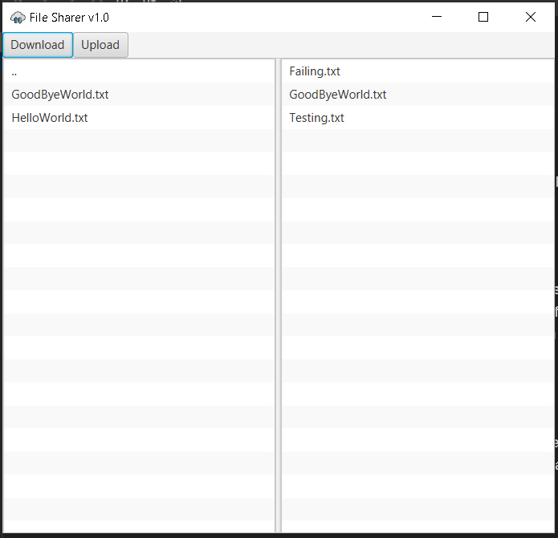

#File Sharer

###Project Information:
This project is a file sharer that shares textfiles between a client and server
on the same local network. The client has the ability to interact with an interface 
that can upload and download textfiles to and from a server. Where the left panel
of the interface represents the local textfiles that the client has on their
local machine and while the right panel represents the textfiles that a server has
on their local machine.

###Improvements:
Compared to the base assignment we added a icon to the top left corner of the client interface.
Client is now able to display the contents of a textfile stored on their local machine in the 
left panel of the interface by double left clicking a textfile. Client is also able to navigate
through parent and sub directories on the left panel of the interface. And finally, instead of
providing a directory path as a commandline argument for the textfiles the client is now able 
to directly choose a directory by using their local operating systems file manager.

###How-to-Run:
The server side program located in the server directory named FileServer.java
needs to be first executed then. The client needs to execute the client side program
located in the client directory named Client.java a popup message will appear asking
the client to choose a directory filled with textfiles. Once they have selected a textfile